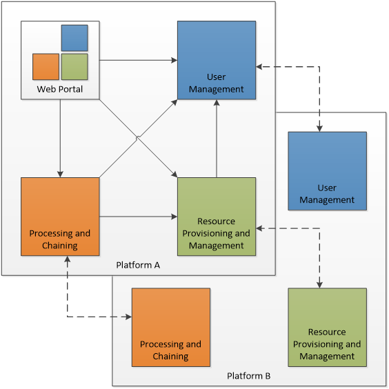

<!--
***
*** To avoid retyping too much info. Do a search and replace for the following:
*** use-case-analysis, twitter_handle, email
-->

<!-- PROJECT SHIELDS -->
<!--
*** See the bottom of this document for the declaration of the reference variables
*** for contributors-url, forks-url, etc. This is an optional, concise syntax you may use.
*** https://www.markdownguide.org/basic-syntax/#reference-style-links
-->

[![Contributors][contributors-shield]][contributors-url]
[![Forks][forks-shield]][forks-url]
[![Stargazers][stars-shield]][stars-url]
[![Issues][issues-shield]][issues-url]
[![MIT License][license-shield]][license-url]
![Build][build-shield]

<!-- PROJECT LOGO -->
<br />
<p align="center">
  <a href="https://github.com/EOEPCA/use-case-analysis">
    
  </a>

  <h3 align="center">EOEPCA Use Case Analysis Document</h3>

  <p align="center">
    Earth Observation Exploitation Platform Common Architecture<br />
    Document source (Asciidoc)
    <br />
    <a href="https://github.com/EOEPCA/use-case-analysis"><strong>Explore the docs »</strong></a>
    <br />
    <a href="https://eoepca.github.io/use-case-analysis">Published</a>
    ·
    <a href="https://github.com/EOEPCA/use-case-analysis/issues">Report Bug</a>
    ·
    <a href="https://github.com/EOEPCA/use-case-analysis/issues">Request Feature</a>
  </p>
</p>

<!-- TABLE OF CONTENTS -->

## Table of Contents

- [Repository Organisation](#repository-organisation)
- [Development](#development)
- [Published Documentation](#published-documentation)
- [Acknowledgements](#acknowledgements)

## Repository Organisation

The document source is in the `master` branch.

The published document is in the `gh-pages` branch.

The `gh-pages` branch contains:

- existing published versions, under path `published/vX.X`
- the current in-progress version (tip of master), under path `current/`
- a landing page with links to the above

The Travis automated build generates the HTML/PDF from the Asciidoc in the `master` branch, and publishes this to `current/` in the `gh-pages` branch.

## Development

During document authoring, the scripts used by the Travis automation pipeline can be executed locally.

In particular the document generation step...

```bash
./docs/bin/generate-docs.sh
```

The document generation relies upon docker to execute the `asciidoctor` command as a container, avoiding the need to install asciidoctor locally, (ref https://hub.docker.com/r/asciidoctor/docker-asciidoctor).

Thus, you need to have installed docker locally in your development platform to support this.

There is also a helper script to present the generated document through a local HTTP server...

```bash
./docs/bin/serve.sh
```

## Published Documentation

The published document is at https://eoepca.github.io/use-case-analysis/.

## Acknowledgements

- README.md is based on [this template](https://github.com/othneildrew/Best-README-Template) by [Othneil Drew](https://github.com/othneildrew).

<!-- MARKDOWN LINKS & IMAGES -->
<!-- https://www.markdownguide.org/basic-syntax/#reference-style-links -->

[contributors-shield]: https://img.shields.io/github/contributors/EOEPCA/use-case-analysis.svg?style=flat-square
[contributors-url]: https://github.com/EOEPCA/use-case-analysis/graphs/contributors
[forks-shield]: https://img.shields.io/github/forks/EOEPCA/use-case-analysis.svg?style=flat-square
[forks-url]: https://github.com/EOEPCA/use-case-analysis/network/members
[stars-shield]: https://img.shields.io/github/stars/EOEPCA/use-case-analysis.svg?style=flat-square
[stars-url]: https://github.com/EOEPCA/use-case-analysis/stargazers
[issues-shield]: https://img.shields.io/github/issues/EOEPCA/use-case-analysis.svg?style=flat-square
[issues-url]: https://github.com/EOEPCA/use-case-analysis/issues
[license-shield]: https://img.shields.io/github/license/EOEPCA/use-case-analysis.svg?style=flat-square
[license-url]: https://github.com/EOEPCA/use-case-analysis/blob/master/LICENSE
[build-shield]: https://www.travis-ci.com/EOEPCA/use-case-analysis.svg?branch=master
[product-screenshot]: images/screenshot.png
